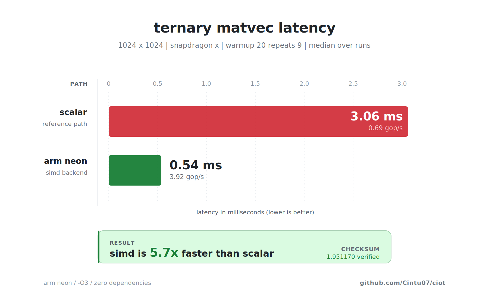
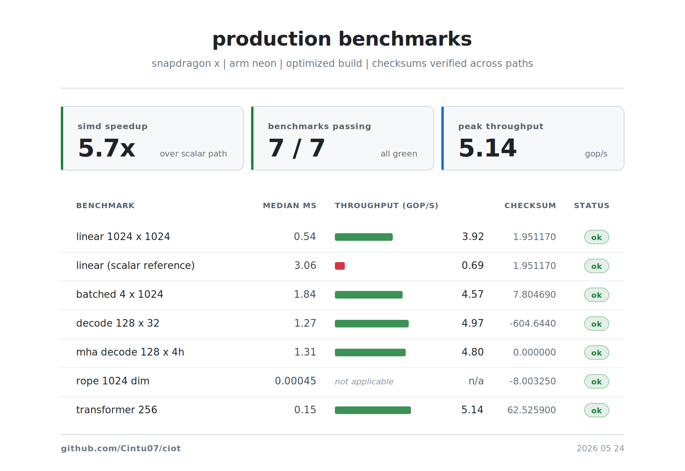
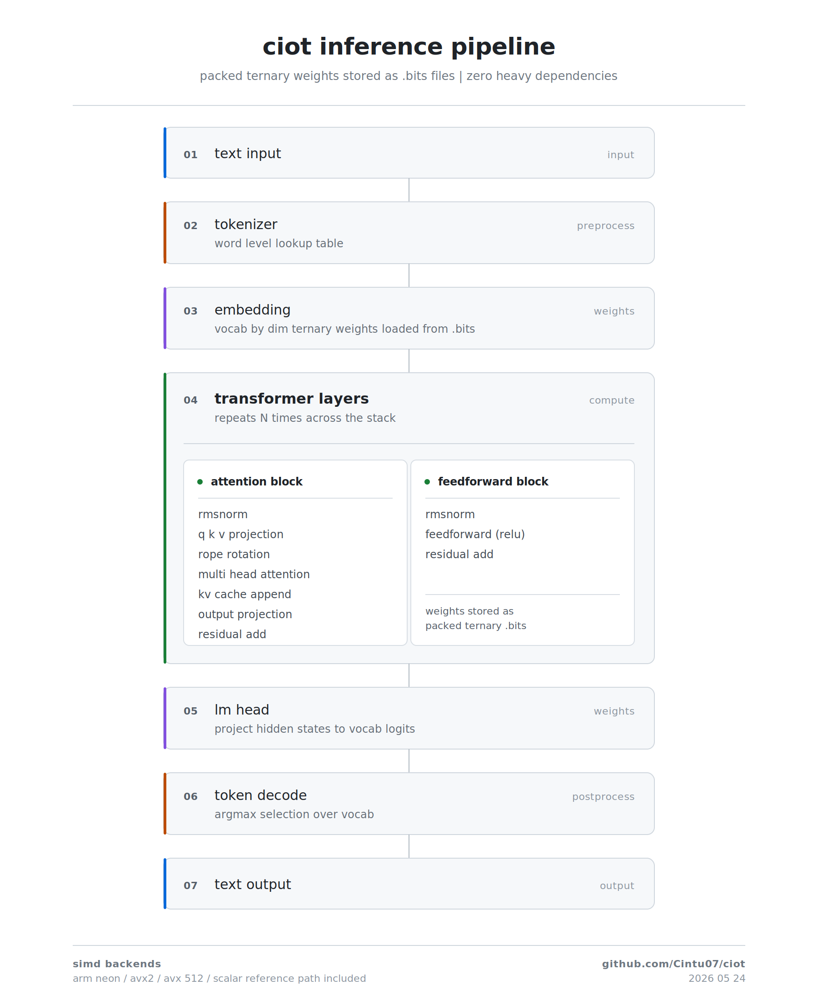

# Ciot

a cpu inference engine for ternary neural networks. no dependencies. just c++ and simd. built by [@Cintu07](https://github.com/Cintu07).

## what it does

ciot takes neural network weights that are only -1, 0, or +1 and runs them directly on your cpu. no gpu. no pytorch, no tensorflow, no blas. just compile it and it runs.

the trick is how the weights are stored. instead of floats, each weight is one of three values. 64 of these weights fit into two 64-bit integers. one integer holds the positions of all the +1s, the other holds the positions of all the -1s. if a position has neither bit set, that weight is a 0.

on a snapdragon x laptop with arm neon, a 1024x1024 matrix multiply against a vector finishes in about half a millisecond. that is roughly 4 billion operations per second. the same code running without simd (scalar path) takes about 3 milliseconds. the checksums are identical, which means the simd version is not cheating. it is just faster.

this is not a full language model. the tokenizer is basic and the training script is tiny. but the inference core is real and produces correct results on arm and x86 cpus.

## how it works, step by step

**packing.** the python packer reads float32 weights, rounds them to -1, 0, or +1 using error compensation (the rounding error from one weight gets added to the next one so the overall signal is preserved), and writes two bit-planes per row into a .bits binary file. each file starts with a `CIOTBIT1` magic header that tells the loader how many rows and columns it has.

**loading.** the c++ loader opens the .bits file, reads the header, allocates aligned memory (64-byte boundaries so simd instructions do not fault), and maps the bit-planes into a row-major struct. from this point onward, no file i/o happens during inference.

**matvec.** for each row of the matrix, the simd kernel processes the row in chunks of 64 columns. each chunk uses one 64-bit positive mask and one 64-bit negative mask. the kernel loads 4 or 8 or 16 input values (depending on the simd backend), uses bitwise comparison to create a pick mask, and conditionally adds or subtracts those values. there are no data-dependent branches in this loop. no if/else. the cpu never mispredicts.

**transformer decode.** a token goes in. it gets embedded into a vector. that vector passes through one or more transformer layers. each layer does rmsnorm, projects the vector into query, key, and value using ternary matvecs, applies rotary position embeddings from a precomputed table (no sin or cos calls during inference), appends the key and value to the kv cache, runs multi-head attention over the accumulated cache, projects the attention output, adds a residual connection, does another rmsnorm, runs a feedforward layer with relu, and adds another residual. at the end, the lm head projects the final vector back to vocabulary space and the token with the highest score is selected.

## what it has

**simd backends.** arm neon for snapdragon and apple silicon. avx2 for most intel and amd cpus. avx-512 for newer server chips. scalar fallback for anything else. all three simd paths produce identical checksums to the scalar reference. you can force the scalar path at runtime with `CIOT_BACKEND=scalar` to prove the speedup is real.

**kv cache.** during decode, each token's key and value vectors are stored in an aligned cache. future tokens attend over all previous tokens. the cache can be reset between sequences. there is both a single-head version and a multi-head version where keys and values are stored per head with an interleaved layout.

**multi-head attention.** the query, key, and value projections are split into heads. each head attends independently using scaled dot-product attention with causal masking (tokens only see past tokens). the per-head outputs are concatenated back together before the output projection.

**rope.** rotary position embeddings are precomputed into sin and cos tables when the model loads. during inference, applying rope is a simple table lookup and multiply-add. no transcendental functions in the hot path.

**tokenizer.** word-level tokenizer that loads a vocabulary file (one word per line). it can encode text into token ids and decode ids back to words. it is simple but it works for small vocabularies.

**model loader.** models are described by a config file (key=value pairs for dim, layers, heads, vocab size) and a directory of .bits weight files. the loader reads the config, allocates all matrices and norm weights, and loads each .bits file. embedding weights and lm head weights are separate files. each layer has six ternary matrices (wq, wk, wv, wo, w1, w2) and two norm weight arrays.

**trainer.** a pure-python transformer trainer that uses only the standard library. it takes a text file, builds a vocabulary, trains a tiny multi-head transformer with cross-entropy loss and sgd, quantizes all weights to ternary with error compensation, and exports a complete .bits model directory. it is not going to train a good model (the architecture is tiny and sgd is not adam), but it proves the full pipeline from text to .bits artifacts.

**benchmark harness.** every benchmark runs with warmup, multiple repeats, and outputs median, p95, min, max, throughput in gop/s, and a checksum. the checksum is the sum of all output values. if the simd checksum does not match the scalar checksum, the kernel is broken. they always match. this is how you know the numbers are not inflated by compiler tricks or incorrect math.

## benchmarks

these numbers are from a snapdragon x laptop with arm neon, compiled with -O3. your numbers will vary.

| benchmark | median ms | gop/s | checksum | status |
|---|---|---|---|---|
| linear 1024x1024 | 0.54 | 3.92 | 1.951170 | ok |
| linear (scalar ref) | 3.06 | 0.69 | 1.951170 | ok |
| batched 4x1024 | 1.84 | 4.57 | 7.804690 | ok |
| decode 128x32 | 1.27 | 4.97 | -604.644 | ok |
| mha decode 128x4h | 1.31 | 4.80 | 0.000000 | ok |
| rope 1024-dim | 0.00045 | -- | -8.003250 | ok |
| transformer 256 | 0.15 | 5.14 | 62.525900 | ok |

the scalar row is the same binary forced to use the scalar path at runtime. checksums are identical across all seven benchmarks. simd is about 5.7x faster for the 1024x1024 matvec.

<p align="center">
  
  <br><em>scalar vs neon on snapdragon x, 1024x1024 ternary matvec</em>
</p>

<p align="center">
  
  <br><em>all seven benchmarks, checksum verified</em>
</p>

<p align="center">
  
  <br><em>inference pipeline from text to tokens</em>
</p>

## build

```
make
```

or without make:

```
g++ -std=c++17 -O3 -march=native -Wall -Wextra -Iinclude \
  src/main.cpp src/kernels/ternary_simd.cpp src/linalg/linear.cpp \
  src/model/ops.cpp src/model/tiny_transformer.cpp src/model/kv_cache.cpp \
  src/model/mha_cache.cpp src/model/tokenizer.cpp src/model/model_loader.cpp \
  -o bin/ciot
```

for explicit simd targets on x86:

```
make avx2     # forces avx2
make avx512   # forces avx-512
```

## run

```
./bin/ciot --backend                       # which simd backend
./bin/ciot --simd-test                     # 10 + 20 = 30 smoke test
./bin/ciot --bench-linear-pro 1024 1024 200 9 20    # hero number
./bin/ciot --bench-suite                   # 256 to 2048 scaling
./bin/ciot --bench-batch 1024 1024 4 50 5            # multi-token matvec
./bin/ciot --bench-decode-mha 128 4 32 8 3           # mha decode
./bin/ciot --bench-transformer 256 50 5 10            # transformer block
./bin/ciot --bench-rope 1024 2048 1000 5              # rope benchmark
./bin/ciot --decode-generate 64 16                    # single-head text
./bin/ciot --model-generate data/trained_model "hello" 12    # full model
```

scalar comparison:

```
CIOT_BACKEND=scalar ./bin/ciot --bench-linear-pro 1024 1024 20 5 5
```

## test

```
make test
```

or:

```
python scripts/run_tests.py
```

this compiles, runs every benchmark, compares simd against scalar, validates checksums, and writes a csv.

## train a model

```
python scripts/train_tiny_transformer.py data/your_text.txt data/my_model \
  --dim 32 --heads 2 --layers 1 --epochs 30
```

then:

```
./bin/ciot --model-generate data/my_model "your prompt" 20
```

## layout

```
ciot/
  include/           Ciot.h (one header, everything declared here)
  src/kernels/       simd matvec (avx-512, avx2, neon, scalar fallback)
  src/linalg/        aligned allocator, matrix ops, .bits loader
  src/model/         rmsnorm, rope, softmax, kv cache, mha cache
                     attention, transformer blocks, tokenizer, model loader
  src/main.cpp       cli entry point, all benchmarks and generation commands
  scripts/           python tools: packer, trainer, test runner, chart maker
  tests/             correctness tests (scalar vs simd, rope, softmax, kv cache)
  data/              .bits model files, benchmark csvs, svg charts
```

## why

i wanted to know how fast ternary weights can run without any framework overhead. the answer is: pretty fast. and the simd kernels are verifiably correct because the checksums match.

the project stays intentionally narrow. if a feature does not help run ternary weights faster, it goes in a python script outside the core. the core itself is one header, no std vector in hot loops, no runtime dispatch overhead beyond a single static flag, and cache aligned memory throughout.
